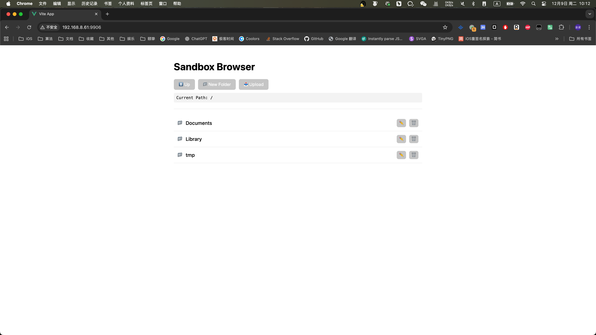
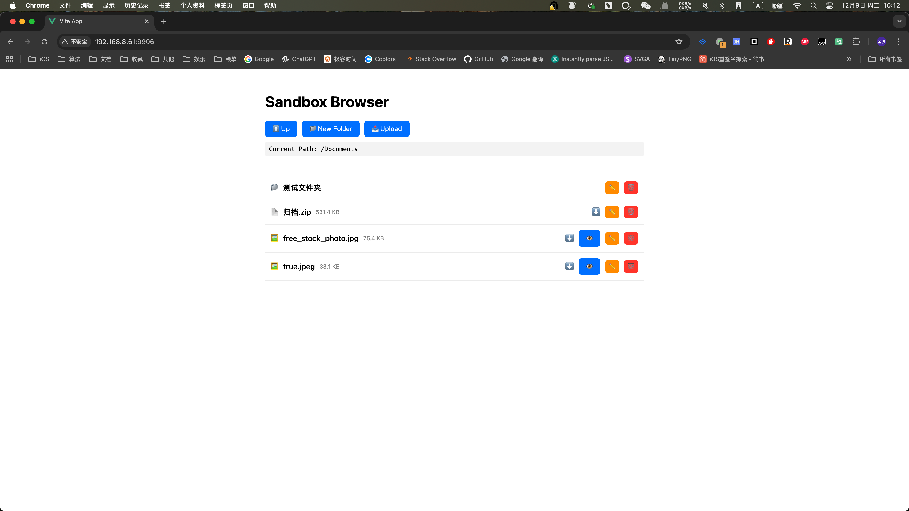

# KBSanboxBrowser

[](https://travis-ci.org/kimball/KBSanboxBrowser)
[](https://cocoapods.org/pods/KBSanboxBrowser)
[](https://cocoapods.org/pods/KBSanboxBrowser)
[](https://cocoapods.org/pods/KBSanboxBrowser)

KBSanboxBrowser is a powerful iOS sandbox file browser that allows you to manage your app's sandbox files via a web interface over a local network. It uses `GCDWebServer` for the backend and a modern `Vue 3` application for the frontend.

## Features

- **Web Interface**: Clean and responsive UI built with Vue 3.
- **File Management**:
  - List files and folders.
  - Create new folders.
  - Upload files from your computer/phone.
  - Delete files and folders.
  - Rename files and folders.
  - Download files.
- **File Preview**: Directly preview various file types in the browser:
  - Images (`jpg`, `png`, `gif`, `webp`, etc.)
  - Audio (`mp3`, `wav`, `aac`, etc.)
  - Video (`mp4`, `mov`, etc.)
  - PDF documents.
  - Text and Code files (`txt`, `json`, `xml`, `swift`, `js`, `log`, etc.)
- **Security & Permissions**:
  - Root directory protection: Prevents creating folders, uploading files, renaming items, or deleting folders in the sandbox root.
  - Hides sensitive system files (`SystemData`, `.plist`) in the root directory.

## Screenshots

<p align="center">
  
  
</p>

## Example

To run the example project, clone the repo, and run `pod install` from the Example directory first.

## Requirements

- iOS 10.0+
- Swift 5.0+

## Installation

To install KBSanboxBrowser, simply add the following line to your Podfile:

```ruby
pod 'KBSanboxBrowser', :git => 'https://github.com/Kimball-Han/KBSanboxBrowser.git'
```

## Usage

Import the module and start the server, typically in your `AppDelegate` or a debug view controller.

```swift
import KBSanboxBrowser

// Start the server (default port: 9906)
KBSandboxBrowser.shared.start()

// Get the server URL to display to the user
if let url = KBSandboxBrowser.shared.serverURL {
    print("Server started at: \(url.absoluteString)")
}

// Stop the server
KBSandboxBrowser.shared.stop()
```

Don't forget to add `NSLocalNetworkUsageDescription` and `NSBonjourServices` (_http._tcp) to your `Info.plist` to allow local network access on iOS 14+.

## Author

kimball, 

## License

KBSanboxBrowser is available under the MIT license. See the LICENSE file for more info.
